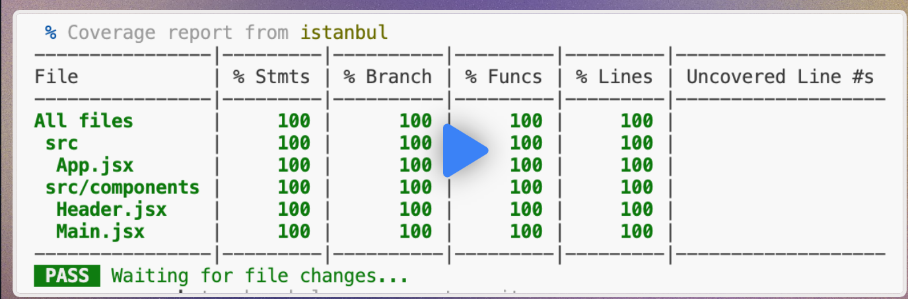

# Steps to set up the tooling:

1. Install the testing framework: `vitest`.
```
npm install -D vitest
```

2. Install the React Testing Library and its companions to render React components, add DOM matchers, and initiate user events.
```
npm install -D @testing-library/react @testing-library/jest-dom @testing-library/user-event
```

3. Install a DOM environment to run the tests: `jsdom`.
```
npm install -D jsdom
```

4. Create the setup file in the project root, `test-setup.js`, and in it add:
```
import "@testing-library/jest-dom/vitest";
import { afterEach } from 'vitest'
import { cleanup } from "@testing-library/react";

afterEach(() => {
    cleanup();
});
```

5. In `vite.config.js`, add this `test` config:
```
test: {
    setupFiles: ["./test-setup.js"],
    environment: 'jsdom'
  }
```

6. Add the test script in `package.json`.
```
"test": "vitest"
```

7. Run `vitest` in `watch mode`.
```
npm run test
```


to mock dependency

we can use msw

npm install -D msw@1.3.5 you can use more latest msw


Code Coverage is a metric for test runners that guages how much of of a program source code is executed during testing

https://vitest.dev/guide/coverage.html


How to run:

https://vitest.dev/guide/coverage.html




npm install -D @vitest/coverage-instabul

add to package json 

"test:coverage":"vitest --coverage"


in vite.onfig 

export default defineConfig({
  plugins: [react()],
  test: {
    setupFiles: ["./test-setup.js"],
    environment: 'jsdom',
    coverage: {
      provider: 'istanbul'
    }
  }
})


to test coverage

npm run test:coverage


to exclude a file from coverage adjust the vitest config


import { defineConfig } from 'vite'
import { coverageConfigDefaults } from 'vitest/config'
import react from '@vitejs/plugin-react'

// https://vite.dev/config/
export default defineConfig({
  plugins: [react()],
  test: {
    setupFiles: ["./test-setup.js"],
    environment: 'jsdom',
    coverage: {
      provider: 'istanbul',
      exclude: ['./src/index.jsx', ...coverageConfigDefaults.exclude]
    }
  }
})


# Software Testing

Software testing can be classified in several ways depending on **how testing is performed**, **what is being tested**, and **the level of the system being tested**.

---

## 1. Manual vs Automated Testing

### Manual Testing

A human tester executes test cases and verifies whether the actual results match the expected results.

```text
Human → Performs Action → Observes Result → Verifies
```

### Automated Testing

Tests are written as scripts and executed automatically using testing tools or frameworks.

```text
Test Script → Runs Software → Checks Result → Pass / Fail
```

For example:

```javascript
expect(add(2, 3)).toBe(5);
```

Manual and automated testing describe **how the test is executed**, not what kind of functionality is being tested.

---

# 2. Functional vs Non-Functional Testing

## Functional Testing

Functional testing verifies **what the system does**.

It checks whether the software behaves according to its functional requirements.

Examples:

* Can a user log in?
* Can an order be created?
* Can an order be cancelled?
* Does payment processing work?
* Does the API return the expected response?

```text
Requirement
    ↓
Input → System → Expected Output
```

---

## Non-Functional Testing

Non-functional testing verifies **how well the system operates** rather than a specific business function.

It evaluates qualities such as:

* Performance
* Security
* Scalability
* Reliability
* Usability
* Compatibility

For example:

```text
Functional:
Can 1 user place an order?

Non-functional:
Can 10,000 users place orders simultaneously?
```

---

# 3. Testing Levels

These describe **how much of the system is being tested**.

## Unit Testing

Tests a small individual unit of code in isolation.

Usually:

```text
Function
Method
Class
Small component
```

Example:

```javascript
function calculateTotal(price, quantity) {
    return price * quantity;
}

expect(calculateTotal(10, 3)).toBe(30);
```

---

## Integration Testing

Tests whether multiple components work correctly **together**.

Example:

```text
OrderService
     ↓
OrderRepository
     ↓
PostgreSQL
```

You might test:

```text
POST /orders
      ↓
OrderService
      ↓
Repository
      ↓
Database
```

to verify that the components integrate correctly.

---

## System Testing

Tests the **complete application/system** as a whole.

```text
Frontend
   ↓
API
   ↓
Business Logic
   ↓
Database
   ↓
External Services
```

The objective is to verify that the complete system satisfies its requirements.

---

## Acceptance Testing

Tests whether the software satisfies the **business/user requirements**.

The question becomes:

> Does this system actually solve what the user or business asked for?

For example:

```text
Requirement:

A warehouse employee must be able to
create an order and reserve inventory.

Acceptance test:

Create Order
    ↓
Confirm Order
    ↓
Inventory Reserved
    ↓
Order = CONFIRMED
```

---

# 4. Common Testing Types

## Regression Testing

Regression testing verifies that **existing functionality still works after changes have been made**.

Example:

```text
Existing system
      ↓
Add new payment feature
      ↓
Run existing tests again
      ↓
Check nothing was broken
```

Regression testing can include both functional and non-functional tests.

---

## Smoke Testing

Smoke testing is a **small, quick set of tests** used to determine whether a build is stable enough for more detailed testing.

Example:

```text
Application starts?      ✓
Database connects?       ✓
Login works?             ✓
Main API responds?       ✓

→ Continue testing
```

If basic functionality is already broken, there is little reason to run hundreds of detailed tests.

---

# 5. Common Non-Functional Tests

## Performance Testing

Measures how the system performs under different workloads.

Examples include:

### Load Testing

Tests expected or high levels of usage.

```text
100 users
1,000 users
10,000 users
```

### Stress Testing

Pushes the system beyond its expected capacity to determine its limits and how it behaves under failure conditions.

```text
10K users → OK
20K users → OK
50K users → Slow
100K users → Failure
```

---

## Security Testing

Tests whether the system is protected against vulnerabilities and unauthorized access.

Examples:

* Authentication
* Authorization
* Injection attacks
* Data exposure
* API security
* Permission violations

---

## Usability Testing

Evaluates whether the application is intuitive and easy for users to use.

Examples:

* Is navigation understandable?
* Can users easily complete important tasks?
* Are error messages understandable?
* Is the interface confusing?

---

## Compatibility Testing

Tests whether the software works correctly across different environments.

Examples:

```text
Chrome
Firefox
Safari

Windows
macOS
Linux

Desktop
Tablet
Mobile
```

---

# Mental Model

Don't think of all these testing terms as one flat list.

They answer **different questions**:

```text
SOFTWARE TESTING
│
├── HOW is it executed?
│   ├── Manual
│   └── Automated
│
├── WHAT is being evaluated?
│   ├── Functional
│   └── Non-Functional
│
├── AT WHAT LEVEL?
│   ├── Unit
│   ├── Integration
│   ├── System
│   └── Acceptance
│
└── WHAT PURPOSE / QUALITY?
    ├── Regression
    ├── Smoke
    ├── Performance
    │   ├── Load
    │   └── Stress
    ├── Security
    ├── Usability
    └── Compatibility
```

### Easy way to remember

**Unit** → Does this piece work?

**Integration** → Do these pieces work together?

**System** → Does the whole application work?

**Acceptance** → Does it satisfy the user's/business's requirements?

**Regression** → Did my changes break anything that previously worked?

**Smoke** → Is the build healthy enough to bother testing further?

**Performance** → Is it fast and stable under load?

**Security** → Is it protected?

**Usability** → Can people use it comfortably?

**Compatibility** → Does it work across the required environments?


